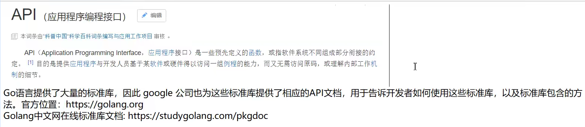
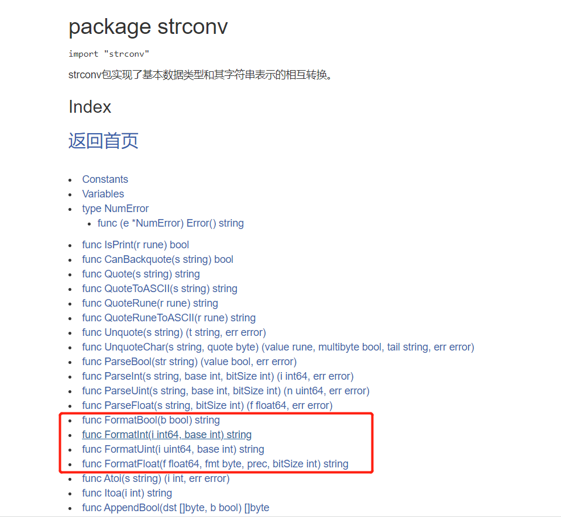
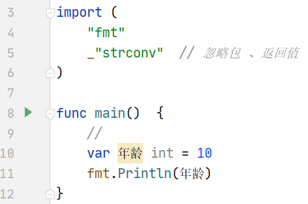
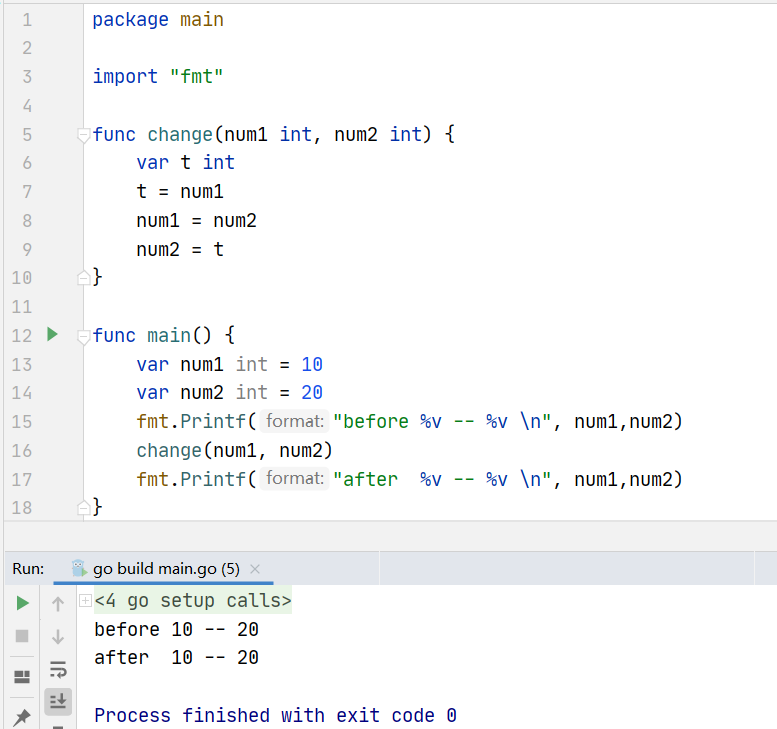

# 第1章：走进golang

## Golang引入

## Golang简史

## 开发工具介绍

## 开发环境搭建


## dos系统


```go
dos命令
dir      --
cd xxx
c:  d:   e:      -- 盘符 不分大小写
cls   -- 清屏
cd xxx    -- tab 补全
md 33  -- 创建目录
rd 33  -- 删除目录
```

## go基本目录结构


## 第一段程序

```go
go build  -- 编译型的语言
go run    -- 执行
```

## go执行流程


## 语法注意事项


## 注释

## 官方建议单行注释

## 代码风格

## API

产品说明书




# 第2章：基本变量和类型

## 变量

```go
package main
import "fmt"

//全局变量
var n7 = 100
var n8 = 9.7

var (
	n9 = 500
	n10 = "netty"
)

func main()  {
	var num int = 18
	fmt.Println(num)
	
	var num2 int
	fmt.Println(num2)

	var num3 = "tom"
	fmt.Println(num3)

	sex := "男"
	fmt.Println(sex)

	fmt.Println("------------------------------------------------------")

	var n1,n2,n3 int
	fmt.Println(n1)
	fmt.Println(n2)
	fmt.Println(n3)

	var n4,name,n5  = 10,"jack",7.8
	fmt.Println(n4)
	fmt.Println(name)
	fmt.Println(n5)

	n6,height := 6.9,100.6
	fmt.Println(n6)
	fmt.Println(height)
	fmt.Println("---------------")
	fmt.Println(n7)
	fmt.Println(n8)

	fmt.Println(n9)
	fmt.Println(n10)
}
```

## 数据类型


## 整数类型


```go
package main
import "fmt"

func main(){
	//
	var num1 int8 = 23
	fmt.Println(num1)
	var num2 int8 = 230
	fmt.Println(num2)
}
```


```go
-- 小总结
int type

int8 int16 int32 int64
uint8 uint16 uint32 uint64
int     ------   
```


```go
package main
import "fmt"

func main()  {
	//
	var num1 uint8 = 230
	fmt.Println(num1)
	var num2 uint8 = -20
	fmt.Println(num2)
}
```


```go
package main
import "fmt"

func main()  {
	//
	var num3 = 28
	fmt.Printf("num3的类型是： %T", num3)
}
```


计算变量占用字节数 8字节 --- 64位


【5】这么多整数类型，使用的时候该如何选择呢？

Golang程序中整型变量在使用时，遵守保小不保大的原则，

即：在保证程序正确运行下，尽量使用占用空间小的数据类型

## 浮点类型


## 字符类型


中文是unicode编码，

```go
var c4 byte = '中'  -- 报错  
var c4 int = '中'  -- 报错  20013 
```

查看字符编码

[查看字符编码（UTF-8） (mytju.com)](http://mytju.com/classcode/tools/encode_utf8.asp)


字符类型本质就是一个整数，也可以直接参与运算，输出字符的时候，会将对应的码值做一个输出

字母、数字、标点等字符，底层都是按照ASCII进行存储。

var c4 int = ‘中’

汉子字符，底层对应unicode码值

‘中’  对应的码值为20013，byte类型溢出，能存储的范围：可以用int

总结：Golang的字符对应的使用的是UTF-8编码(Unicode对应的是字符集，UTF-8是Unicode的其中一种编码方案)

```go
var c5 byte = 'A'
fmt.Printf(" %c ", c5)  -- 打印字符的方法
```


```go
package main
import "fmt"

func main()  {
	// 转义字符
	// \n 换行
	fmt.Println("aaa\nbbb")
	// \b 退格
	fmt.Println("aaa\bbbb")
	// \r 光标移到开头（删除前面所有）
	fmt.Println("aaa\rbbb")

	fmt.Println("aaaaaaaaaaaaa")  
	fmt.Println("aaaaaaaaaaa")  // 8位一个制表符  跟8对齐
	fmt.Println("aaa\tbbb")
	fmt.Println("aaaaaaaa\tbbbbb")

	// \"
	fmt.Println("\"Golang")     // 
	fmt.Println("\"Golang\"")  //
}
```

## 布尔类型


## 字符串类型

```go
func main()  {
	var s1 string = "你好xxxxxx Golang"
	fmt.Println(s1)
	// 2.字符串不可变指的是字符串一旦定义好 ，其中的字符的值不能改变
	//var s2 string = "abc"

	// 3.字符串的表示形式  包含特殊字符
	//var s3 string = "avsgg\"gdfhgghd"
	//反引号
	var s4 string = `package main
	import "fmt"

	func main()  {
		// 转义字符
		// \n 换行
		fmt.Println("aaa\nbbb")
		// \b 退格
		fmt.Println("aaa\bbbb")
		// \r 光标移到开头（删除前面所有）
		fmt.Println("aaa\rbbb")
	
		fmt.Println("aaaaaaaaaaaaa")  
		fmt.Println("aaaaaaaaaaa")  // 8位一个制表符  跟8对齐
		fmt.Println("aaa\tbbb")
		fmt.Println("aaaaaaaa\tbbbbb")
	
		// \"
		fmt.Println("\"Golang")     // 
		fmt.Println("\"Golang\"")  //
	}`
	fmt.Println(s4)

	// 字符串的拼接效果：
	var s5 string = "abc" + "def"
	s5 += "hijk"
	fmt.Println(s5)

	// go自动在末尾加上 ;  所以 + 号要放在行尾
	var s6 string = "abc" + "def" + "abc" + "def" + "abc" + "def" + "abc" + "def" + 
	"abc" + "def" + "abc" + "def" + "abc" + "def" + "abc" + "def" + "abc" + "def" + 
	"abc" + "def" + "abc" + "def" + "abc" + "def" + "abc" + "def" + "abc" + "def" 
	fmt.Println(s6)
	
}
```

## 基本数据类型默认值

```go
func main()  {
	var a int 
	var b float32 
	var c float64 
	var d bool
	var e string 
	fmt.Println(a)
	fmt.Println(b)
	fmt.Println(c)
	fmt.Println(d)
	fmt.Println(e)
}
```


基本数据类型之间的转换

```go
func main()  {
	//
	var n1 int = 100
	var n2 float32 = float32(n1)
	fmt.Println(n1)
	fmt.Println(n2)
    fmt.Printf("%T" ,n2)
}
```


```go
//
var n1 int = 100
var n2 float32 = float32(n1)
fmt.Println(n1)
fmt.Println(n2)
fmt.Printf("%T" ,n2)
fmt.Println()

// 将int64转化为int8的时候， 编译不会出错的，但是数据会溢出
var n3 int64 = 888888
var n4 int8 = int8(n3)
fmt.Println(n4)  // 56

var n5 int32 = 12
//var n6 int64 = n5 + 30
fmt.Println(n5)
//fmt.Println(n6)

var n7 int64 = 12
var n8 int8 = int8(n7) + 127  // 编译通过，但是结果可能溢出
var n9 int8 = int8(n7) + 128  // 编译不会通过
fmt.Println(n8)
fmt.Println(n9)
```


基本数据类型转为string  -- string 首字母小写


## 基本数据类型转string

### [官网API  ](https://studygolang.com/pkgdoc)


测试：

1、fmt.Sprintf("%参数",表达式)          ---推荐你用这个

```go
var n1 int  = 19
var n2 float32  = 4.78
var n3 bool = false
var n4 byte  = 'a'

var s1 string = fmt.Sprintf("%d", n1);
fmt.Println()
fmt.Printf("%T -- %q  ", s1, s1)

var s2 string = fmt.Sprintf("%f", n2);
fmt.Println()
fmt.Printf("%T -- %q  ", s2, s2)

var s3 string = fmt.Sprintf("%t", n3);
fmt.Println()
fmt.Printf("%T -- %q  ", s3, s3)

var s4 string = fmt.Sprintf("%c", n4);  // %c	该值对应的unicode码值
fmt.Println()
fmt.Printf("%T -- %q  ", s4, s4)
```

2、strconv  -- 相对于方式一没有那么常用




## string转为基本数据类型


```go
//
var s1 string  = "true"
// func ParseBool(str string) (value bool, err error)
var b bool 
b, _ = strconv.ParseBool(s1)   // 下划线忽略 那个error返回值
fmt.Printf("%T --- %v \n",b, b)
```


小总结：

```go
format -- base  ----> string
parse  -- string ---> base
```


## ----复杂数据类型----

（派生数据类型）

## 指针

【1】基本数据类型和内存


【2】指针变量


案例：


总结：最重要的就是两个符号

1、& 取内存地址

2、* 根据地址取值

## 指针细节


```go
//
var num int = 10
fmt.Println(num)

var ptr *int = &num
*ptr = 20
fmt.Println(num)

GOROOT=D:\Enviroment\Go #gosetup
GOPATH=C:\Users\86568\go #gosetup
D:\Enviroment\Go\bin\go.exe build -o C:\Users\86568\AppData\Local\Temp\___go_build_main_go__3_.exe C:/Users/86568/Desktop/go/mashibing/goproject/src/gocode/testproject01/unit2/demo15/main.go #gosetup
C:\Users\86568\AppData\Local\Temp\___go_build_main_go__3_.exe #gosetup
10
20
```


## 标识符的使用


1、中文也是unicode字符

```go
func main()  {
	//
	var 年龄 int = 10
	fmt.Println(年龄)   -- ok
}
```

下划线的作用：忽略





不建议使用 int作为变量名 （标识符）


- main入口函数  必须 要在main包下

- 包名不要和标准库冲突      package fmt       ------- code
- 大写--public  小写--private  利用首字母大写小写完成权限控制

Gopath ？？？？？

## 关键字和预定义标识符


# 第3章：运算符


## 算术运算符


```go
func main() {
	var n1 int = +10
	fmt.Println(n1)
	var n2 int = 3 + 10
	fmt.Println(n2)
	var s1 string = "aaa" + "bbb"
	fmt.Println(s1)
}
```


## 赋值运算符

```go
var num1 int = 10
fmt.Println(num1)
var num2 int = (10+20)%3 + 3 - 7
fmt.Println(num2)

var num3 int = 10
num3 += 20
fmt.Println(num3)
```

## 关系运算符


## 逻辑运算符


## 位运算符  -- 很少用

## 其他运算符


```go
-- 
作用：
& 取变量的地址
* 指向某一变量  取变量的值
1 使用 * 之前必须使用&
2 只能关联一个变量

func main() {
	var age int = 10
	fmt.Println(&age)

	var ptr *int = &age
	fmt.Println(ptr)
	fmt.Println(*ptr)
}
```

## 运算符的优先级


**一句话：为了提高优先级，可以加（）**

## 获取用户终端输入


```go
func main() {
	// 实现功能: 键盘录入学生的年龄,姓名,成绩,是否是VIP
	// 方式1： ScanIn
	var age int
	fmt.Println("请输入学生的年龄: ")
	fmt.Scanln(&age)

	var name string
	fmt.Println("请输入学生的姓名: ")
	fmt.Scanln(&name)

	var score float32
	fmt.Println("请输入学生的成绩: ")
	fmt.Scanln(&score)

	var isVIP bool
	fmt.Println("请输入学生的是否是VIP: ")
	fmt.Scanln(&isVIP)
	
	fmt.Printf(" %v -- %v--%v--%v--", age,name,score,isVIP)
}
```


# 第4章：流程控制

## 流程控制的引入


## 分支结构

### if分支

#### 单分支


```go
func main() {
	//var count int = 100
	//
	//if count < 30 {
	//	fmt.Println("xxxxxxxxxxxxxx")
	//}

	if count := 20; count < 30 {
		fmt.Println("hadjajhdhja")
	}
}
```

#### 双分支


#### 多分支


## 循环结构

### for循环


代码演示：

视频里也不可以。。


### 细节

```go
//格式灵活

for i := 1; i <= 5; i++ {
    sum += i
}

var i int
for i = 1 ; i <= 5 ; i++ {
    sum += i
}
fmt.Println(sum)


-- 
i := 1
for i <= 5 {
    fmt.Println("hello Golang")
    i++
}

// 死循环
for {
    fmt.Println("dead circuit")
}


```


一般采用下面这种写法：


### for range


```go
var str string = "hello golang"

// 按字节遍历输出
for i := 0; i < len(str); i++ {
    fmt.Printf("%c \n", str[i])
}


for i, i2 := range str {
    fmt.Printf("%d---%c ", i, i2)
}
// out
0---h 1---e 2---l 3---l 4---o 5---  6---g 7---o 8---l 9---a 10---n 11---g 
```


### 关键字

#### break


```go
var sum int = 0
for i := 1; i <= 100; i++ {
    sum += i
    fmt.Println(sum)
    if sum >= 300 {
        break  // 停止正在执行的循环
    }
}
```


```go
// double for
for i := 1; i <= 5; i++ {
    for j := 2; j <= 4; j++ {
        fmt.Printf("%v -- %v \n", i, j)
        if i == 2 && j == 2 {
            break  // 只管一层
        }
    }
}

lable:
for i := 1; i <= 5; i++ {
    for j := 2; j <= 4; j++ {
        fmt.Printf("%v -- %v \n", i, j)
        if i == 2 && j == 2 {
            break lable
        }
    }
}
```


1、break结束离他最近的循环

2、加label  结束label指定位置（外层循环）


#### continue


```go
for i := 1; i <= 100; i++ {
    if i % 6 != 0 {
        continue  // 结束本次循环，还要继续下一次循环
    }
    fmt.Println(i)
}
```

#### goto


#### return

```go
func main() {
	for i := 1; i <= 100; i++ {

		fmt.Println(i)
		if i == 14 {
			return  // 结束当前函数
		}
	}
	fmt.Println("hello golang")
}
```


# 第5章：函数

## 函数的引入


案例：

```go
package main

import "fmt"
func cal(num1 int, num2 int) (int) { // 如果返回值类型只有一个的话，那么可以不写()
	var sum int = 0
	sum += num1
	sum += num2
	return sum
}
func main() {
	// 功能
	fmt.Println(cal(10, 10))
}
```


## 函数细节详讲


```go
返回0个，没有return 没有返回类型
func f() {
    ....
}
返回1个，那么返回类型的那个（）可以不写

如果有返回值不想接收，用下划线_  接收
```


【5】通过例题感受内存分析：





形参：接收到了 10 20 ，值传递。


非常经典的面试题：怎么样交换两个变量的值，用内存分析来作答


```go
package main

import "fmt"
func test(args... int)  {

}
func main() {
	test()
	fmt.Println("----------")
	test(3)
	test(37,1,2,3)
}
```


类型：函数类型       %T   ==func（int）==


test和a对应的函数类型都是 ： func(int)


[13]  返回类型要对应，顺序不能差。。


？？视频里面可以啊


## 包的引入


快速案例：

包名是从$GOPATH/src/ 后开始计算的，使用/ 进行路径分隔。

```go
package main

import (
   "fmt"
   "gocode/testproject01/unit5/demo09/crm/dbutils"
)
func main() {
   fmt.Println("hello this is main run ")
   dbutils.GetConn()
}
```


## GOPATTH

gopath采坑记录：gopath是先读用户变量再读系统变量。我既设置了用户变量，也设置了系统变量。


## Goland编辑器小技巧


## 包的细节详解

- main函数一定要放在main包下。
- 在同一个包下不能定义重名函数。
- 包名的声明和文件夹可以不一致。
- 同一文件夹下的包名要一致。（几个源文件的case）


## init函数


**【2】**

```go
package main
import (
	"fmt"
)
var num int = test()  // 全局变量
func test() int {
	fmt.Println("test 函数执行了")
	return 0
}
func init() {
	fmt.Println("init 函数执行了")
}
func main() {
	fmt.Println("main 函数执行了")
}
-----------------out
test 函数执行了
init 函数执行了
main 函数执行了

// 第一步，全局变量定义  第二部，init函数的调用 第三部，main函数的调用   
```


【3】

导包的源文件：先执行全局变量初始化，再执行init函数。。


程序执行顺序：


结论：导包的时候，全局变量和init  都有了，就是说都会执行。导包一定在程序的最开始执行吗？

全局变量比init函数先执行。。

## 匿名函数


````java
func main() { // case :1 2
	// 定义匿名函数：调用一次就死了
	result := func(num1 int, num2 int) int{
 		return num1 + num2
	}(10, 20)
	fmt.Println(result)

	//将匿名函数赋给一个变量，这个变量实际就是函数类型的变量
	sub := func(num1 int, num2 int) int{
		return num1 - num2
	}
	result01 := sub(30,70)   // 直接调用sub
	fmt.Println(result01)
}
````


## 闭包


匿名函数中引用的那个变量会一直保存在内存中，可以一直使用。

## defer关键字


## 系统函数

### 字符串相关函数


### 日期和时间相关函数

[package time](https://studygolang.com/pkgdoc)     --ctrl + F  time  在time包里面实现了时间相关的函数


### 内置函数


num指针变量：

自身地址 存储的地址 指向变量的值

&num   num *num    

类型：*int


# 第6章：错误处理

## defer+recover机制处理错误

## 自定义错误

# 第7章：数组

## 数组的引入


```go
// 数组定义格式
// var 数组名  [容量]数据类型
var score [5]int
score[0] = 21
score[1] = 95
score[2] = 91
score[3] = 39
score[4] = 60
```


## 内存分析

1 内存连续

2 自动初始化0值

3 一个空间占2个字节

```go
var arr [3]int16
fmt.Println(arr[0])
fmt.Println(len(arr))
fmt.Printf("%p", &arr)
fmt.Printf("%p", &arr[0])
```


## 数组遍历


## 数组的初始化方式


```go
package main

import "fmt"

func main() {
	var arr1 [3]int = [3]int{3, 6, 9}
	fmt.Println(arr1)

	var arr2 = [3]int{1,4,7}
	fmt.Println(arr2)

	var arr3 = [...]int{4,5,6,7}
	fmt.Println(arr3)

	var arr4 = [...]int{2: 66, 0: 33, 1: 99, 3: 88}
	fmt.Println(arr4)
}
```


## 注意事项


[1]数组类型细节

````go

func main() {
	var arr1  = [3]int{3, 6, 9}
	fmt.Printf("%T\n", arr1)

	var arr2 = [6]int{1,4,7,8}
	fmt.Printf("%T\n", arr2)
}
// out
[3]int
[6]int
````

[2]值传递  （数组竟然是值传递）

```go
package main
import "fmt"
func main() {
	var arr3 = [3]int{3, 6, 9}
	test1(arr3)
	fmt.Println(arr3)
}
func test1(arr [3]int) {
	arr[0] = 22  //不会改变main函数里面的arr3
	fmt.Println(arr[0]) 
}
// out 
22
[3 6 9]
```


**深拷贝：**


[3] 传指针 --- 修改main arr3数组值


```go
package main
import "fmt"
func main() {
	var arr3 = [3]int{3, 6, 9}
	test1(&arr3)
	fmt.Println(arr3)
}
func test1(arr *[3]int) {
	(*arr)[0] = 22   // 修改了main函数里面的arr3
}
// out
[22 6 9]  
```


## 二维数组


# 第8章：切片

## 切片的引入

数组切的一个片段

## 内存分析

code

```go
package main

import "fmt"

func main() {
   var intarr [6]int = [6]int{3, 6, 9, 1, 4, 7}

   var slice []int = intarr[1:3]

   slice2 := intarr[1:3]  // 包含1 不包含3

   fmt.Println(intarr)
   fmt.Println(slice)
   fmt.Println(slice2)

   fmt.Println(len(slice)) // 切片个数
   fmt.Println(cap(slice)) // 获取切片的容量
   fmt.Println(len(intarr))
   //
   fmt.Printf("%p -- %p\n", &intarr[1], slice) // 可以说数组是指针 slice是指针吗？？
   fmt.Printf("%p\n", &slice[0])
   fmt.Printf("%p\n", &slice[1])

   slice[1] = 77
   fmt.Println(intarr)
}
//out
[3 6 9 1 4 7]
[6 9]
[6 9]
2
5
6
0xc00000c3f8 -- 0xc00000c3f8
0xc00000c3f8
0xc00000c400
[3 6 77 1 4 7]
```

内存


## 切片定义

[1]定义一个切片，然后让切片去引用一个已经创建好的数组。

[2]通过make内置函数来创建切片。基本语法：var切片名[type = make([], len, [cap])]

[3]定义一个切片，直接就指定具体数组，使用原理类似make的方式。


[2]

```go
// 定义切片：make函数的三个参数： 1 切片类型 2 切片长度 3 切片容量
slice := make([]int,4,20)
fmt.Println(slice)
fmt.Println(len(slice))
fmt.Println(cap(slice))
slice[0] = 66
slice[1] = 88
fmt.Println(slice)
```

ps:make底层创建了一个数组，对外不可见，所以不可以直接操作这个数组，要通过slice去间接访问各个元素，不可以直接对数组进行维护/操作

[3] 

```go
slice2 := []int{1,4,7}
fmt.Println(slice2)
fmt.Println(len(slice2))
fmt.Println(cap(slice2))
// 长度、容量都为3
```


## 切片遍历


```go
// 直接打印就可以 为什么还要遍历
for i := 0; i < len(slice); i++ {
    fmt.Println(slice[i])
}
for i, value := range slice {
    fmt.Println(i, value)
}
```

## 切片注意事项


[3]简写

```go
var slice = arr[0:end] --> var slice = arr[:end]
var slice = arr[start:len(arr)] --> var slice = arr[start:]
var slice = arr[0:len(arr)] --> var slice = arr[:]
```

[4]

```go
var intarr [6]int = [6]int{1,4,7,2,5,8}
var slice []int = intarr[1:4]
slice2 := slice[1:2]
fmt.Println(slice2)
```

[5]切片可以动态增长

hello world


....


# 第9章：map

## map的引入


map：特点

1 map集合在使用前一定要make

2 key无序且唯一

```go
var a map[int]string
a = make(map[int]string,10)

a[5127512] = "zs"
a[9080888] = "lisi"
a[8392643] = "ww"

fmt.Println(a)
```


## map的三种创建方式


[2]

```go
b := make(map[int]string)
b[12345] = "zs"
b[12346] = "lisi"
fmt.Println(b)
```

[3]

```go
c := map[int]string{
    2001:"zhangsan",
    2002:"lisi",
}
c[2004] = "wangwu"
fmt.Println(c)
```

## map的操作


```go
b := make(map[int]string)
// add
b[111] = "zs"
b[222] = "lisi"
// update
b[111] = "ww"
//delete
delete(b, 222)
delete(b, 12)
//
value,flag := b[111]
fmt.Println(value)
fmt.Println(flag)

// 遍历只有 for range一种
for k, v := range b {
    fmt.Println(k, v)
}
```

# 第10章：面向对象

## 引入


## 结构体--对象


## 结构体实例创建

```go
// 1 
package main

import "fmt"
type Teacher struct{
   Name string
   Age int
   School string
}
func main() {
   var t1 Teacher //
   fmt.Println(t1)
   t1.Name = "msb"
   t1.Age = 45
   t1.School = "qhdx"
   fmt.Println(t1)
   fmt.Println(t1.Age)
}
```

// 2 创建结构体


```go
// 3 指针
type Teacher struct{
	Name string
	Age int
	School string
}
func main() {
	var t *Teacher = new(Teacher)

	(*t).Name = "mashibing"
	(*t).Age = 45 // * 的作用：根据地址取值
	t.School = "清华大学" // (*t).School 都可以
	fmt.Println(*t)
}
// 4 
func main() {
	var t *Teacher = &Teacher{}
	(*t).Name = "马士兵"
	(*t).Age = 45
	t.School = "清华大学"
	fmt.Println(*t)
}
```

## 结构体之间转换


